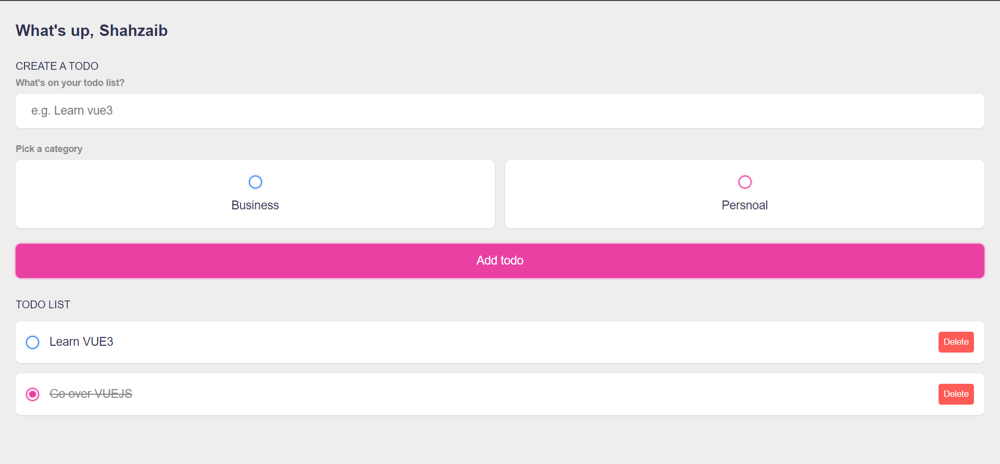

# vue3-todo-app

Purpose of this project is to go over `vuejs` and learn new things of `vue3`.

I follow this youtube tutorial to brush up vuejs [Build a Todo List App in Vue JS](https://www.youtube.com/watch?v=qhjxAP1hFuI)

Instructor wrote all the code in one file but I break into small components to brush up more concepts of `vue`

Happy Coding 🙌 !
